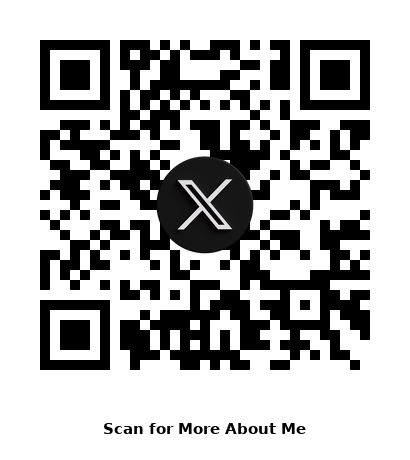
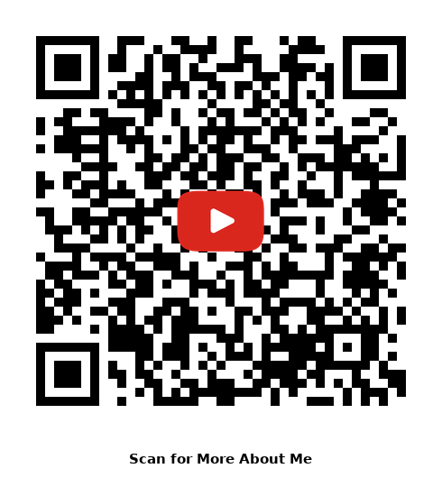

[](https://github.com/ajakaiye33/qr_code_generator/actions/workflows/ci.yml)

# QR Code Generator CLI

This project provides a QR code generator with additional features like adding logos and text below the QR code. A Command Line Interface (CLI) is provided for ease of use.

## Table of Contents

- [Features](#features)
- [Project Structure](#project-structure)
- [Setup](#setup)
  - [Prerequisites](#prerequisites)
  - [Installation](#installation)
- [Configuration](#configuration)
- [Usage](#usage)
- [Samples](#samples)
- [Contributing](#contributing)
- [License](#license)


## Features

- Generate QR codes for URLs.
- Customize QR codes with logos or any photo.
- Add text below the QR codes.
- Configurable via a JSON file.
- Docker support for containerized deployment.
- Automated CI/CD pipeline with GitHub Actions basically for tests and format.

## Project Structure


## Setup

### Prerequisites

- Python 3.10 or higher
- Docker (optional, for containerized usage)
- Make (optional, for using the Makefile)

### Installation

1. Clone the repository:

```
git clone https://github.com/ajakaiye33/qrcode-generator.git
bash cd qrcode-generator
```


2. Install the required Python packages:

```
make install
```


### Configuration

Update the configuration file at config/config.json with the following content:

```
{
    "urls_and_texts": [
        {"url": "https://www.url/of/your/social/media/profile", "text": "Scan for More About Me"},
        {"url": "https://www.another/url/of/social/media/profile", "text": "Scan for More About Me"},
        ...
    ],
    "logo_path": "./image/snapchatlogo.png", [logo image or any photo you would like to put on your qrcode to perdonalize it]
    "font_path": "./image/DejaVuSans-Bold.ttf",[only change this if you know what you are doing]
    "output_dir": "./output" [after running the code check this folder for your generated QR Code, png file]
}
```

### Usage

Generate QR codes via the CLI:
 ``` 
 python main.py
 ``` 
 or 
 ```
 python app.py --config config/config.json --output ./output 
 ```

### Samples

Here are some samples of the generated QR codes:


<details>
<summary>See Generated QR codes</summary>


 




</details>

... Now GO generate yours :wink:

### Contributing

Contributions are welcome! Please fork the repository and create a pull request.

- Fork the repository
- Create a new branch (git checkout -b feature-branch)
- Commit your changes (git commit -am 'Add new feature')
- Push to the branch (git push origin feature-branch)
- Create a new Pull Request

### License

This project is licensed under the MIT License. See the LICENSE file for details.
